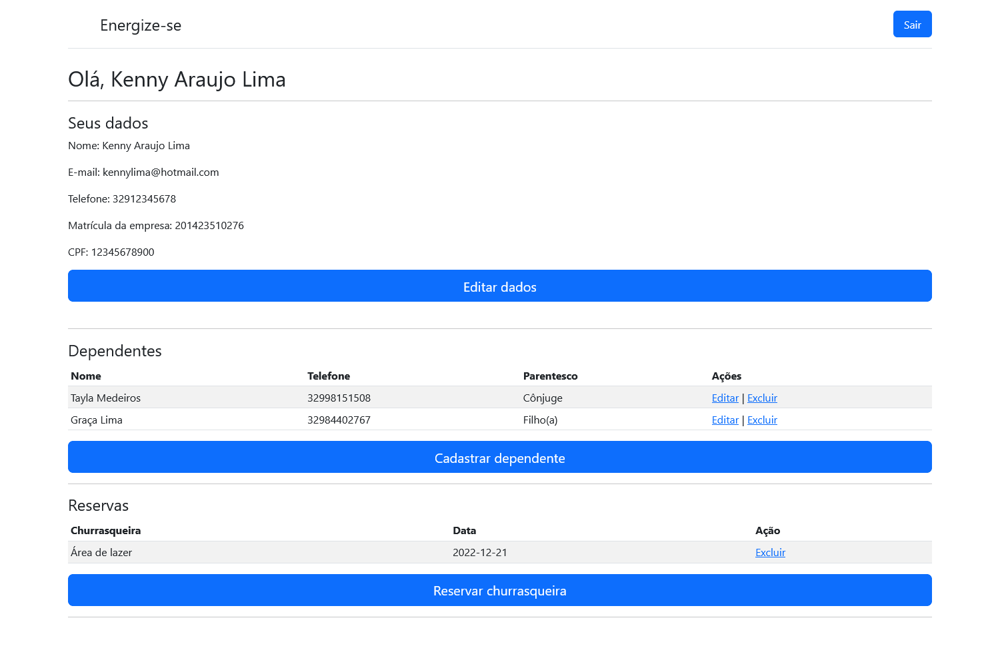

# Sistema para administração de um clube de esportes

## Sistema desenvolvido no projeto Rio Pomba Valley em parceria com a Energisa, Senai e EduLivre. 

> Sobre:

Seguindo uma situação problema disponibilizada na pasta *documentation*, foi desenvolvido um projeto para administrar um clube de esportes. O projeto foi idealizado com três tipos de clientes. O associado, o administrador nível 1 e administrador nível 2. Neste sistema é possível:

- O associado realizar o seu cadastro;
- O administrador nível 2 aceitar ou recusar o cadastro;
- O associado somente poder realizar login após o administrador nível 2 aprovar o seu cadastro;
- Após aprovado, o associado pode cadastrar, editar e excluir dependentes;
- Após aprovado, o associado pode cadastrar e excluir reservas de churrasqueiras;
- O sitema não permite a reserva de uma mesma churrasqueira no mesmo dia;
- O sistema possui um sistema de encriptografar senhas, o bcrypt;
- O sistema é dotado de sessões, sendo impossível navegar entre as rotas sem estar logado;
- Após realizar o login com o seu cadastro, o administrador nível 1 consegue consultar um associado pelo nome, que através do método JOIN no banco de dados, retorna o nome, status e dependente do associado e também consegue visualizar todas reservas de churrasqueiras cadastradas;
- Após realizar o login, o administrador nível 2 consegue também consultar um associado e visualizar reservas de churrasqueiras, além de aprovar ou recusar novos associados;

## 🛠 Tecnologias 
- HTML
- CSS
- JavaScript
- NodeJs
- MySQL
- Handlebars
- Framework Express
- Framework Express-session
- Framework Sequelize
- Git
- Github

## 💻 Contato 

 > kennylima@hotmail.com